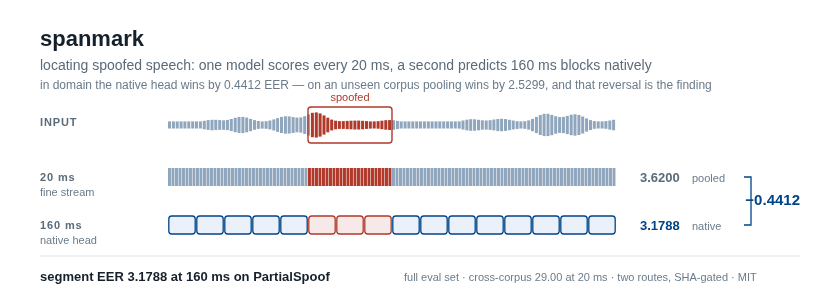

<p align="center">
  <picture>
    <source media="(prefers-color-scheme: dark)" srcset="assets/readme/hero-dark.png">
    
  </picture>
</p>

# spanmark

*spanmark: two-route segment localization of partially spoofed speech*


[](https://huggingface.co/RootAccess4Life/spanmark)

> 📦 Checkpoints: **[RootAccess4Life/spanmark](https://huggingface.co/RootAccess4Life/spanmark)**
> — [native160](https://huggingface.co/RootAccess4Life/spanmark/tree/main/native160)
> is the released model and the artifact of record &nbsp;·&nbsp;
> [fine20](https://huggingface.co/RootAccess4Life/spanmark/tree/main/fine20)
> is the 20 ms partner it verifies by hash.
> Both are sha256-pinned in `scripts/download_weights.py`; fetch with
> `python scripts/download_weights.py`.

**Find which parts of an utterance are spoofed.** A fine model scores every
20 ms segment. A second model predicts 160 ms blocks *natively* rather than by
pooling the fine stream — worth **0.4412 EER in domain**, and worth *−2.5299*
off it. That reversal is the most useful thing in this repo; see
[Cross-corpus](#cross-corpus).

**Segment EER 3.1788 / F1 96.84 at 160 ms on PartialSpoof**, over the full
71,237-utterance evaluation set — the best W2V2-XLSR system on that cell,
ahead of SAL's XLS-R variant (3.32) on an identical F1. Two WavLM systems
score lower: BFC-Net 2.73 and SAL 3.00.

**Cross-corpus, segment EER 29.0048 / F1 61.23 at 20 ms on LlamaPartialSpoof**,
on SAL's protocol — the crossfade release in full, 76,228 utterances, from a
model trained only on PartialSpoof. That is ahead of every system in SAL's
cross-corpus table, the best of which is 35.52 / 55.30.

```bash
git clone https://github.com/pujariaditya/spanmark && cd spanmark
pip install -e . && ./setup.sh
python scripts/download_weights.py          # both routes, sha256-verified
./scripts/demo_score.sh                     # scores a few utterances, writes an npz
```

## Two routes, one deployment

The released checkpoint is not a single model. `checkpoints/active.txt` names
the native-160 model; that checkpoint's `deployment` block names its 20 ms
partner **by sha256**, and inference refuses to start if the partner is missing,
renamed, or altered. Six conditions are checked and every one fails closed:

```python
resolution_specific_deployment(blob)   # -> (fine_path, (160,))  or raises
```

Scoring runs the fine model first, asserts it emitted no native grid, frees it,
then runs the native model and asserts it emitted no fine stream. Both streams
land in one `.npz`: `scores`/`offsets` on the 20 ms grid, `scores_160`/
`offsets_160` on the coarse one.

Why bother, when you could pool? Because pooling loses:

| 160 ms scores obtained by | segment EER |
| --- | --- |
| min-pooling the 20 ms stream | 3.6200 |
| the native 160 ms head | **3.1788** |
| | **Δ 0.4412** |

Same utterances, same fine model underneath. The coarse decision is not a
summary of the fine one — **on the corpus the head was trained against**. On an
unseen corpus the ordering flips; see [Cross-corpus](#cross-corpus).

## Results

Full PartialSpoof evaluation set, 71,237 utterances / 12,217,526 segments.
Released `native160` checkpoint with its `fine20` partner.

| resolution | EER | F1 | obtained from |
| --- | --- | --- | --- |
| 20 ms | 4.1663 | 96.57 | the fine model directly |
| 40 ms | 4.0309 | 96.60 | min-pooled from 20 ms |
| 80 ms | 3.8541 | 96.57 | min-pooled from 20 ms |
| **160 ms** | **3.1788** | **96.84** | **the native head** |
| 320 ms | 3.4548 | 95.73 | min-pooled from 20 ms |
| 640 ms | 3.3745 | 93.81 | min-pooled from 20 ms |

At 160 ms against published figures. Front-end matters more than method here,
so it is a column: spanmark is a **W2V2-XLSR** system, and the WavLM rows are
not a like-for-like comparison.

| system | front-end | EER | F1 |
| --- | --- | --- | --- |
| BFC-Net (Neurocomputing 2025) | WavLM | **2.73** | 96.69 |
| SAL (ICASSP 2026) | WavLM | 3.00 | **97.09** |
| **spanmark** | **W2V2-XLSR** | **3.1788** | **96.84** |
| SAL (ICASSP 2026) | W2V2-XLSR | 3.32 | 96.84 |
| BFC-Net (Neurocomputing 2025) | W2V2-XLSR | 3.41 | — |
| BAM (Interspeech 2024) | WavLM | 3.58 | 96.09 |
| BAM (Interspeech 2024) | W2V2-XLSR | 4.12 | 94.98 |
| Multi-reso (Interspeech 2023) | W2V2-Large | 9.24 | — |

**Best W2V2-XLSR system in the table** — ahead of SAL's XLS-R variant by 0.14
EER on an identical F1, and ahead of BFC-Net's by 0.23. Two WavLM systems are
ahead of it on EER, and swapping the front-end is the obvious thing to try next;
it was never run here.

Baseline figures are quoted from SAL's Table 1 so that every row comes from one
reproduction under one protocol. BAM's own paper reports 3.63 / 95.95 for its
WavLM system rather than the 3.58 / 96.09 SAL measures.

Two things to know before comparing:

1. The evaluation manifests used during development were anonymised and are not
   shipped; you build your own with `scripts/prepare_data.py`. Numbers are
   comparable only against the same corpus release.
2. One 160 ms block is worth **0.000128 EER** over this set's 1,558,425 blocks,
   so the Δ 0.4412 gap is about 3,438 block-crossings. (On the 8,000-utterance
   tune slice this task was developed against, one block was 0.001157 — nine
   times coarser, which is why several mechanism families scored
   indistinguishably during development.)

The checkpoint was selected on that tune slice, where it measured 3.1583 at
160 ms. The full set puts it at 3.1788, so selection cost about 0.02 — and the
two-route gap came out slightly *larger* here (0.4412 against 0.4297).

### Provenance

Both checkpoint sidecars ship with the weights and carry more than metadata,
and the two carry different records because the two routes were trained
differently.

The **fine** sidecar holds the full training `recipe`, the 12 `matched_controls`
the checkpoint was selected against with their scores, a `source_lock` of sha256
over the 16 files that produced it, and the `preregistration` written before the
runs.

The **native** sidecar holds the preregistered `plan` with its own `plan_sha256`,
the `selection` record naming all 34,118 trained parameters, and the
frozen-tensor digest taken before and after training — 492 tensors, identical
hash at both ends (`53338f40ed58f048…`). That last one is the useful bit:
"everything else frozen" becomes a checkable fact about the artifact rather than
a claim about the configuration.

## Cross-corpus

The same checkpoint, unchanged, on **LlamaPartialSpoof** — a corpus it never saw
in training. This is the evaluation SAL argues the field should be judged on,
and it is run here on SAL's protocol exactly: the **crossfade** release
(`R01TTS.0.a`), **all 76,228 utterances**, scored at **20 ms**, from a model
trained solely on PartialSpoof.

| resolution | EER | F1 | source |
| --- | --- | --- | --- |
| **20 ms** | **29.0048** | **61.23** | **the fine model directly** |
| 40 ms | 28.7752 | 61.19 | min-pooled from 20 ms |
| 80 ms | 28.3279 | 61.10 | min-pooled from 20 ms |
| 160 ms | 30.0332 | 58.01 | the native head |
| 160 ms | **27.5033** | | **min-pooled — pooling wins by 2.5299** |
| 320 ms | 26.1057 | 60.84 | min-pooled from 20 ms |
| 640 ms | 23.9527 | 60.64 | min-pooled from 20 ms |

Against every system in SAL's cross-corpus table, on that same 20 ms cell:

| system | front-end | EER | F1 |
| --- | --- | --- | --- |
| **spanmark** | **W2V2-XLSR** | **29.0048** | **61.23** |
| SAL (ICASSP 2026) | W2V2-XLSR | 35.52 | 55.30 |
| SAL (ICASSP 2026) | WavLM | 36.60 | 56.09 |
| BAM (Interspeech 2024) | WavLM | 42.58 | 53.40 |
| Multi-reso (Interspeech 2023) | W2V2-Large | 47.49 | — |

**Ahead of all four, by 6.52 EER and 5.93 F1 over the best of them.** This is the
one number in this repo that is a like-for-like win: same corpus release, same
subset, same resolution, same training data, and the comparison rows are SAL's
own table rather than a reproduction.

Two things still separate the setups, and neither can be closed from here. Our
LlamaPartialSpoof copy was built without honouring the official 20/59 speaker
split — harmless for this result because training used PartialSpoof only, so no
LPS audio was ever trained on, but it would matter to anyone training on it. And
the 20 ms labels are rasterised from the corpus's own `start-end-label` spans by
midpoint rule; SAL rasterised independently, so small label differences remain
possible even on an identical utterance list. Ours reproduces a previously built
copy of the bona fide + partial subset to within 0.15 % on segment count and
0.04 pp on class balance.

### The two-route advantage does not transfer

| | in domain (PartialSpoof) | cross-corpus (LlamaPartialSpoof) |
| --- | --- | --- |
| native head | **3.1788** | 30.0332 |
| min-pooled | 3.6200 | **27.5033** |
| winner | native, by 0.4412 | **pooling, by 2.5299** |

The native head is not a better coarse decision in general. It is a better coarse
decision *on the corpus it was fitted to*, and off that corpus it is worse than
the trivial alternative of pooling the fine stream — by 2.5299, which is nearly
six times the 0.4412 it wins by in domain. Anyone adopting this should pool
unless they have evidence their data resembles PartialSpoof.

The fine route degrades 7.0x from 20 ms in domain (4.1663) to 20 ms off it
(29.0048); the native head degrades 9.4x. That the coarse route degrades hardest
is the whole finding: it is the part that was fitted to PartialSpoof.

### What this set is, exactly

**10,573 bona fide + 33,461 fully fake + 32,194 partially fake = 76,228
utterances**, which is the published composition of `R01TTS.0.a` in full. The
fully-fake utterances are the ones that make this hard — TRACE measures them at
45.45 % EER against 13-16 % on partial subsets.

An earlier run here scored only the 42,767 bona fide + partial utterances and
reported 28.3773 / 74.75. That set is *easier* than the corpus SAL reports on,
so those figures were never comparable to the table above and are not quoted as
a result. The F1 column is bonafide-positive, the convention the published
columns use.

## Reproduce the table

```bash
export SPANMARK_CORPUS_ROOT=/path/to/PartialSpoof
export SPANMARK_TASKDATA=data/labels                 # where the packed labels go

# --labels is required: verify_benchmark.sh ends in spanmark.evaluate, which
# reads $SPANMARK_TASKDATA/eval_labels/ps_eval.npz. Without it the manifest
# builds and the scoring step fails.
python scripts/prepare_data.py --corpus-root "$SPANMARK_CORPUS_ROOT" \
                               --split eval --labels
python scripts/download_weights.py
./scripts/verify_benchmark.sh               # scores, then reports segment EER
```

`prepare_data.py` prints the bonafide fraction of what it packed. On the
PartialSpoof eval split that is **61.22 %**; a figure near 39 % means your
corpus release labels spoof as 1, and the numbers below will come out inverted
with nothing raising an error.

Training is included, not just inference:

```bash
./scripts/train_phase1.sh                   # XLS-R fine route, 20 ms
./scripts/train_phase2.sh                   # native 160 ms head on a frozen trunk
```

`train_phase2.sh` starts from the released `fine20` checkpoint, which is what
makes the contribution reproducible without rebuilding the fine route first.

What reproduces exactly: **inference**. The deployment gate verifies the fine
partner by hash, so you are provably running the released pair.

What reproduces approximately: **the native head** — 34,118 parameters on a
frozen trunk, cheap and close to deterministic.

What does not reproduce bit-for-bit: **the fine route**. It trains against
resynthesis twins, and the generator that produced the originals was not
preserved. `scripts/build_resynth.py` rebuilds the corpus from the recipe; the
recipe is faithful, the samples are not.

## Where to go next

| where | what is in it |
| --- | --- |
| `spanmark/models/` | the model zoo. `build_model()` dispatches on `blob["arch"]`; every architecture a released checkpoint can carry stays registered there. |
| `spanmark/models/interval.py` | the head the released checkpoint actually trains: dense anchor-free interval geometry over native blocks, 34,118 parameters, everything else frozen. |
| `spanmark/runtime/` | checkpoint loading, the XOR encoder reconstruction that fits 302 M adapted parameters into 291 MB, and the deployment gate. |
| `spanmark/metrics/` | segment EER and F1 on the resolution grid. Labels are **1 = bonafide, 0 = spoof**; an inverted copy reports roughly (100 − EER) and raises nothing. |
| the published sidecars | the record each route was run under, written before the runs rather than after: `plan` on the native route (`hypothesis`, `arms`, per-arm `forecast`, and the stopping rule) and `preregistration` on the fine one (predicted scores with intervals, and the `decision_rule` that promoted it). |

There is no hosted CI. Install on a fresh clone with `pip install -e .`. A CUDA
device is not required — scoring falls back to CPU, without the fp16 autocast
the XLS-R route uses on GPU, so a full evaluation set will take many hours.
`demo_score.sh` checks its own output rather than announcing success: it fails
loudly if the native 160 ms grid is absent, because a missing coarse route
silently min-pools and the headline number collapses with no error.

## Citation

See `CITATION.cff`. Please also cite the systems the tables compare against —
SAL ([arXiv:2601.21925](https://arxiv.org/abs/2601.21925)), BAM (Interspeech
2024) and BFC-Net (Neurocomputing 2025) — and the two corpora: PartialSpoof
(Zhang et al.) and LlamaPartialSpoof (Luong et al.).

## Licence

MIT — see [LICENSE](LICENSE). Third-party components are listed in
[NOTICE](NOTICE); `spanmark/audio/atomic_wave_noise.py` is adapted from RawBoost
and SentryMao/SAL, both MIT, and their attribution headers must be preserved.

No corpus audio or labels are redistributed here.
